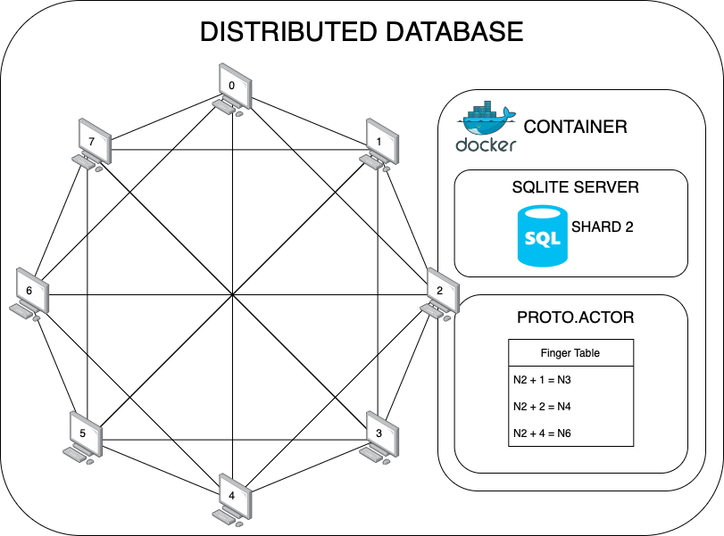

# 🔐 KeyKeeper

## Overview

**KeyKeeper** is a backend module for a distributed malware signature database, built in Go. It leverages a **Distributed Hash Table (DHT)** based on the **Chord protocol** to enable scalable, decentralized storage and lookup of malware signature hashes.



---

## 📦 Prerequisites

- **Go version `1.23`** or later must be installed. You can download it from [golang.org](https://golang.org/dl/).

---

## 🚀 Installation & Setup

1. **Clone the Repository**

   ```bash
   git clone https://github.com/oscardcamargo/CIS4914-KeyKeepers.git
   ```

2. **Navigate to the Source Directory**

   ```bash
   cd CIS4914-KeyKeepers/src
   ```

3. **Install Dependencies**

   Run the following command to download the required Go modules:

   ```bash
   go mod tidy
   ```

4. **Download the Database**

    - The original malware signature dataset is available at [MalwareBazaar](https://bazaar.abuse.ch).
    - A modified and compatible version for this system is hosted [on Google Drive](https://drive.google.com/drive/folders/18VmFDWQL1ayjJoP8AZCehXTQowhdQHd4).
    - **Download** the file `malware_hashes.db` and place it in the root project directory (`CIS4914-KeyKeepers`).

5. **Enable CGO for SQLite Support (Windows Only)**

   To run the program locally with SQLite, Go needs to be able to compile C code:

   **Step 1: Set Environment Variable**

    - Add the following to your IDE's environment variables:
      ```
      CGO_ENABLED=1
      ```
    - **In GoLand**:  
      Go to `Run` → `Edit Configurations...` → Select your run/build configuration (e.g., `go build main.go`) →  
      Add `CGO_ENABLED=1` to the "Environment variables" field.

   **Step 2: Install `tdm-gcc`**

    - Download the 64+32-bit MinGW-w64 edition from [this page](https://jmeubank.github.io/tdm-gcc/articles/2021-05/10.3.0-release).
    - After installation, add the `bin` folder to your system's PATH:
        1. Search for **"Environment Variables"** in Windows.
        2. Under **System Variables**, find `Path` → click **Edit**.
        3. Click **New** and add:
           ```
           C:\TDM-GCC-64\bin
           ```
           *(or wherever you installed TDM-GCC)*

---

## ⚙️ Running a Node

To start a node in the Chord DHT network, use the following command:

```bash
go run . <hostname> <port> <name> [<remote_hostname> <remote_port> <remote_name>]
```

### Parameters Explained:

| Argument            | Description |
|---------------------|-------------|
| `<hostname>`        | Local host's IP address or domain (e.g., `127.0.0.1`) |
| `<port>`            | Port number to run this node on (e.g., `8000`) |
| `<name>`            | Unique identifier for this node (e.g., `Node1`) |
| `<remote_hostname>` | *(Optional)* Hostname of an existing node to join |
| `<remote_port>`     | *(Optional)* Port of the existing node |
| `<remote_name>`     | *(Optional)* Name of the existing node |

> **Note:** If this is the **first node** in the network, leave the last three arguments empty.

### Examples

**Start the first node:**

```bash
go run . 127.0.0.1 8000 Node1
```

**Start a second node and join the first:**

```bash
go run . 127.0.0.1 8001 Node2 127.0.0.1 8000 Node1
```

## 📚 References

Dabek, F., Kaashoek, M. F., Karger, D. R., Morris, R. T., & Stoica, I. (2001). *Wide-area cooperative storage with CFS*. Proceedings of the Eighteenth ACM Symposium on Operating Systems Principles. https://pdos.csail.mit.edu/papers/cfs:sosp01/cfs_sosp.pdf

Estenssoro, J. V. (2024). *Malware and virus statistics 2024: The trends you need to know about*. AVG. https://www.avg.com/en/signal/malware-statistics

Hewitt, C. (2015). *Actor model of computation: Scalable robust information systems*. https://arxiv.org/abs/1008.1459

Johnsen, J., Karlsen, L., & Birkeland, S. (2005). *Peer-to-peer networking with BitTorrent*. https://web.cs.ucla.edu/classes/cs217/05BitTorrent.pdf

Stoica, I., Morris, R., Liben-Nowell, D., Karger, D. R., Kaashoek, M. F., Dabek, F., & Balakrishnan, H. (2003). Chord: A scalable peer-to-peer lookup protocol for internet applications. *IEEE/ACM Transactions on Networking, 11*(1), 17–32. https://doi.org/10.1109/TNET.2002.808407